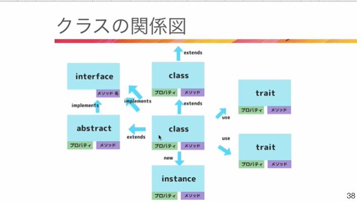
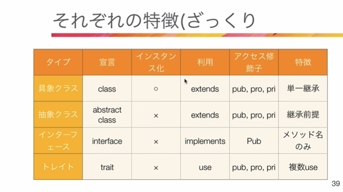
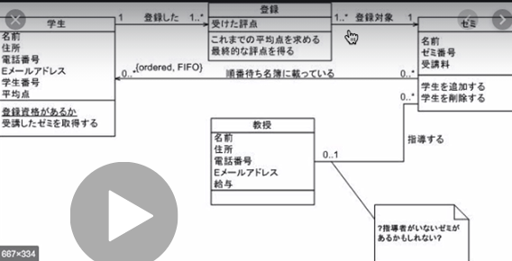

## クラスとは
- 変数、定数→プロパティ
- 関数→メソッド

## オブジェクト指向
- クラスを使ったコード
- 役割分担
- オブジェクト指向の3要素
    - カプセル化
        - 役割分担
    - 継承
        - 関数や変数を引き継ぐ
    - ポリモーフィズム

## クラスの関係図

- 基本
    1. クラスを作成
    2. インスタンス化して使う
    3. 親クラスを作り継承させる

## クラスの種類


- デザインパターン
    - [phpデザインパターン](http://shimooka.hateblo.jp/archive/category/phpdp)
    - [phpデザインパターンソース](https://github.com/shimooka/PhpDesignPattern)

- モダンPHP
    - PSR-1,2,4(phpコーディング規約)
    - namespace(名前空間)
        - [名前空間とは](https://qiita.com/7968/items/1e5c61128fa495358c1f)
        - 名前が同じでも使えるようにする
    - autoload(自動クラス読込)
        - requireを使わなくてもいいようになる
    - composer(phpライブラリ管理+オートロード)

## クラスの書き方
- 簡単なクラス(instance)
```php
class Product{
    //アクセス修飾子, private(外からアクセス不可), protected(自分、継承したクラスのみ使用可能), public(公開)

    //変数
    private $product = [];

    //関数
    function __construct($product){
        $this->product = $product;
    }

    public function getProduct(){
        echo $this->product;
    }

    public function addProduct($item){
        $this->product .= $item;
    }

    public static function getStaticProduct($str){
        echo $str;
    }

}

$instance = new Product('test');

$instance->getProduct();
echo'<br>';

$instance->addProduct('追加分');

$instance->getProduct();

//静的(static)　クラス名::関数名
Product::getStaticProduct('静的');
echo '<br>';
```

- 継承(extends)
    - 親クラスを作り機能継承
```php
//親
class BaseProduct{
    //変数 関数
    public function echoProduct(){
        echo '親クラスです';
    }

    //オーバーライド(上書き)
    class function getProduct(){
        echo '親の関数です'
    }
}

//子クラス
class Product extends BaseProduct{
    //アクセス修飾子, private(外からアクセス不可), protected(自分、継承したクラスのみ使用可能), public(公開)

    //変数
    private $product = [];

    //関数
    function __construct($product){
        $this->product = $product;
    }

    public function getProduct(){
        echo $this->product;
    }

    public function addProduct($item){
        $this->product .= $item;
    }

    public static function getStaticProduct($str){
        echo $str;
    }

}

$instance = new Product('test');

$instance->getProduct();
echo'<br>';

$instance->addProduct('追加分');

$instance->getProduct();

//静的(static)　クラス名::関数名
Product::getStaticProduct('静的');
echo '<br>';
```

- 抽象(abstract)
```php
//抽象クラス　設定するメソッドを強制
abstract class ProductAbstract{
    //変数 関数
    public function echoProduct(){
        echo '親クラスです';
    }

    abstract public function getProduct(){
    }
}

//具象クラス
class BaseProduct{
    //変数 関数
    public function echoProduct(){
        echo '親クラスです';
    }

    //オーバーライド(上書き)
    class function getProduct(){
        echo '親の関数です'
    }
}

//子クラス
//抽象クラスで設定しているメソッドは子クラスで絶対に定義しないといけない
class Product extends ProductAbstract{
    //アクセス修飾子, private(外からアクセス不可), protected(自分、継承したクラスのみ使用可能), public(公開)

    //変数
    private $product = [];

    //関数
    function __construct($product){
        $this->product = $product;
    }

    public function getProduct(){
        echo $this->product;
    }

    public function addProduct($item){
        $this->product .= $item;
    }

    public static function getStaticProduct($str){
        echo $str;
    }

}

$instance = new Product('test');

$instance->getProduct();
echo'<br>';

$instance->addProduct('追加分');

$instance->getProduct();

//静的(static)　クラス名::関数名
Product::getStaticProduct('静的');
echo '<br>';
```

- インターフェース(interface)
```php
//インターフェース(メソッドしかかけない)
interface ProductInterface{
    //変数 関数
    // public function echoProduct(){
    //     echo '親クラスです';
    // }
    abstract public function getProduct(){
    }
}

interface NewsInterface{
    public function getNews();
}
//具象クラス
class BaseProduct{
    //変数 関数
    public function echoProduct(){
        echo '親クラスです';
    }

    //オーバーライド(上書き)
    class function getProduct(){
        echo '親の関数です'
    }
}

//子クラス
//抽象クラスで設定しているメソッドは子クラスで絶対に定義しないといけない
class Product implements ProductInterface, NewsInterface{
    //アクセス修飾子, private(外からアクセス不可), protected(自分、継承したクラスのみ使用可能), public(公開)

    //変数
    private $product = [];

    //関数
    function __construct($product){
        $this->product = $product;
    }

    public function getProduct(){
        echo $this->product;
    }

    public function addProduct($item){
        $this->product .= $item;
    }

    public function getNews(){
        echo 'ニュースです';
    }

    public static function getStaticProduct($str){
        echo $str;
    }

}

$instance = new Product('test');

$instance->getProduct();
echo'<br>';

$instance->addProduct('追加分');

$instance->getProduct();

$instance->getNews();

//静的(static)　クラス名::関数名
Product::getStaticProduct('静的');
echo '<br>';
```

- トレイト(trait)
```php

trait ProductTrait{
    public function getProduct(){
        echo 'プロダクト';
    }
}

trait NewsTrait{
    public function getNews(){
        echo ' news ';
    }
}

class Product{
    use ProductTrait;
    use NewsTrait;

    public function getInformation(){
        echo 'クラスです';
    }

    //オーバーライドも可能
    public function getNews(){
        echo 'クラスのニュースです';
    }

}


$product = new Product();
$product->getInformation();
$product->getProduct();
$product->getNews();
```

- クラス図を作成した上でどのようにオブジェクト指向を使って作成していくか決めると良い。



