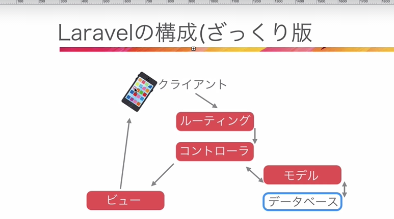

## laravelの概要
- Model:データベースとのやりとり
    - 
- View:見た目
    - 
- Controller:処理
    - 
- Routing:アクセスの振り分け
    - 
- Migration:DBデーブルの履歴管理
    - 



## laravelホーム画面が表示される仕組み
- アクセスするとrouteファイルにいく
    - routes/web.php
    ```
    Route::get('/', function () {
        return view('welcome');
    })
    ```
- viewのwelcomeを表示する
    - resources/views/welcome.blade.php

